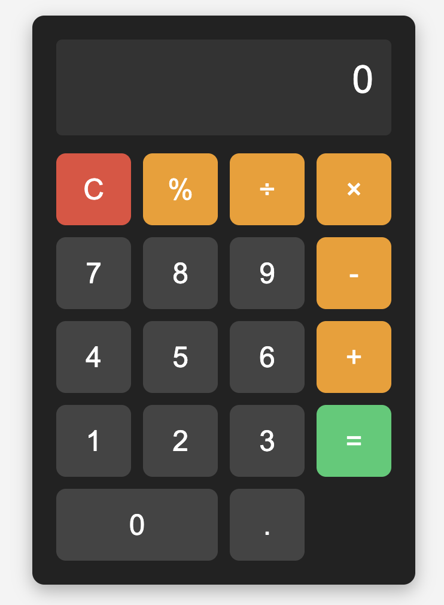

# 🧮 Simple Calculator

This is a basic yet fully functional **Calculator Web App** built using **HTML**, **CSS**, and **JavaScript**. It supports standard arithmetic operations and also allows interaction using both **mouse clicks** and **keyboard inputs**.

---

## 🚀 Features

- Clean and responsive user interface
- Built using:
  - ✅ **HTML** – for structure
  - ✅ **CSS** – for styling
  - ✅ **JavaScript** – for logic and interactivity
- Supports both **mouse clicks** and **keyboard key presses**

---

## ➕ Supported Operations

| Operation | Description                            | Example            |
|----------|----------------------------------------|--------------------|
| `+`      | Addition                                | `5 + 3 = 8`        |
| `-`      | Subtraction                             | `10 - 6 = 4`       |
| `*` or `×` | Multiplication                        | `4 × 2 = 8`        |
| `/` or `÷` | Division                              | `8 ÷ 2 = 4`        |
| `.`      | Decimal point support                   | `3.5 + 1.2 = 4.7`  |
| `C`      | Clear/reset the input                   | Clears the screen  |
| `=`      | Calculate the entered expression        | -                  |
| `%`      | **Percentage logic** – calculates percentage based on the next number | `10%100 = 10` (means 10% of 100) |

> Example: `100 + 10%200` will be interpreted as `100 + (200 × 10 ÷ 100)` = `120`.

---

## ⌨️ Keyboard Support

This calculator can also be operated directly using your keyboard.

| Key        | Action             |
|------------|--------------------|
| `0`–`9`     | Input numbers       |
| `+ - * /`   | Arithmetic operators|
| `.`        | Decimal point       |
| `%`        | Percent operator    |
| `Enter` / `=` | Calculate result |
| `C` or `Esc` | Clear display     |
| `Backspace` | Delete last digit |

---

## 📁 File Structure
```
calculator/
├── index.html
├── style.css
└── script.js 
```

## 📸 Screenshot



---


## Created by [Atul Mishra](https://github.com/AtulMishra001)